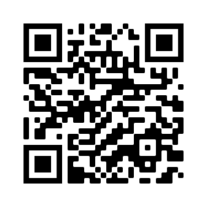

# Acceso a la presentación {data-background-image="assets/images/videos1.jpg" data-background-opacity="0.18"}

## {data-background-image="assets/images/videos1.jpg" data-background-opacity="0.18"}

{width=60%}

[https://pbeltran.github.io/semhispabrasil2020](https://pbeltran.github.io/semhispabrasil2020)

# Introducción y marco teórico {data-background-image="assets/images/videos1.jpg" data-background-opacity="0.18"}

## Idoneidad didáctica

Grado en que un proceso de instrucción reúne ciertas características que permiten calificarlo como adecuado para la adaptación entre los significados personales obtenidos por los alumnos (aprendizaje) y los significados institucionales, ya sean pretendidos o implementados (enseñanza), considerando la influencia del entorno (Godino, 2013). 

## Idoneidad didáctica

{width=65%}

Fuente: Godino (2013).

## Faceta epistémica

:::incremental
- La faceta epistémica se refiere, en términos de Breda et al., (2017) a la enseñanza de una buena matemática.
- La idoneidad epistémica se considera mayor en la medida que los contenidos pretendidos o implementados representan bien a los contenidos de referencia. Dos criterios fundamentales (Godino, 2013):
	- La presencia de diversos significados del contenido correspondiente y su interconexión.
	- El reconocimiento de la diversidad de objetos primarios y procesos implicados para los diversos significados.
:::

## Faceta epistémica

Las **situaciones-problemas** tienen un rol central en el EOS, de modo que los objetos matemáticos participan y emergen de los sistemas de prácticas matemáticas.

. . .

>Se trata de dar una respuesta satisfactoria a la cuestión del significado de los objetos matemáticos

:::incremental
- ¿Qué es la media?
- ¿Qué es el número?
:::

## Faceta epistémica

Bajo esta perspectiva ontosemiótica, la actividad matemática se puede describir y analizar a partir de una ontología explícita de objetos (Godino et al., 2007):

:::incremental
- **Lenguajes**: en sus diversos registros y representaciones, natural, gestual, simbólico, gráfico, etc..
- **Situaciones-problemas**: aplicaciones intra y extra-matemáticas, ejercicios, problemas.
- **Reglas**:
	- _Conceptos-definición_: conceptos introducidos mediante definiciones o descripciones, proporcionalidad, función, etc.
	- _Proposiciones_: enunciados sobre conceptos-definición.
	- _Procedimientos_: algoritmos, operaciones, técnicas de cálculo.
- **Argumentos**: enunciados usados para validar o explicar las proposiciones y procedimientos.
:::

## Criterios de idoneidad

:::incremental
- Para cada faceta Godino (2013) propone un sistema de criterios generales para que sean consideradas de calidad. 
- Breda, Pino-Fan, & Font (2017) señalan que estos criterios de idoneidad didáctica son potentes herramientas para organizar la reflexión y evaluación de un proceso de instrucción.
	- Es conveniente utilizarlos para analizar y valorar los vídeos de la muestra considerada. 
- Santos (2018) propone un modelo para valorar vídeos educativos de matemáticas:
	- Idoneidad didáctica (EOS).
	- Lógica difusa para considerar la evaluación mediante una opinión de las comunidades de interés
	- Métodos multicriterio (TOPSIS), para ordenar los datos obtenidos y tomar decisiones a partir de ellos.
:::

## Criterios generales de idoneidad epistémica

Siguiendo a Godino (2013)

> Situaciones-problema

- Se presenta una muestra representativa y articulada de situaciones de contextualización, ejercitación y aplicación
- Se proponen situaciones de generación de problemas (problematización)

##

> Lenguajes

- Uso de diferentes modos de expresión matemática, traducciones y conversiones entre ellos. 
- Nivel del lenguaje adecuado a los niños a que se dirige.
- Se proponen situaciones de expresión matemática e interpretación.

##

> Reglas (definiciones, procedimientos, propiedades)

- Las definiciones y procedimientosson claros y correctos, y estánadaptados al nivel educativo al que se dirigen.
- Se presentanlos enunciados y procedimientos fundamentales del tema para el nivel educativo dado.
- Se proponen situaciones donde los alumnos tengan que generar o negociar definiciones proposiciones o procedimientos.

## 

> Argumentos

- Las explicaciones, comprobaciones y demostraciones son adecuadas al nivel educativo a que se dirigen.
- Se promueven situaciones donde el alumno tenga que argumentar.

> Relaciones

- Los objetos matemáticos (problemas, definiciones, pro- posiciones, etc.) se relacionan y conectan entre sí. 
- Se identifican y articulan los diversos significados de los objetos que intervienen en las prácticas.

# Propuesta y método de investigación

## GVID para probabilidad

En Beltrán-Pellicer, Godino y Giacomone (2018) se obtuvo una propuesta de indicadores de idoneidad didáctica para procesos de enseñanza y aprendizaje de la probabilidad. 

Los indicadores correspondientes a la faceta epistémica se muestran en la Tabla 1 de nuestra [comunicación](https://www.researchgate.net/publication/341164498_Algunas_propuestas_de_aplicacion_de_indicadores_de_idoneidad_didactica_en_probabilidad).

## Aplicaciones de este tipo de indicadores

> Evaluación de vídeos en línea sobre contenidos concretos

 En [Beltrán-Pellicer, Giacomone y Burgos (2018)](https://tierradenumeros.com/publication/201810-cye-online-videos/201810-cye-online-videos.pdf) aplicamos una GVID específica para repartos propocionales. 
 

## ¿Por qué interesarnos en esto? {data-background-image="assets/images/videos1.jpg" data-background-opacity="0.18"}

- El fenómeno de los vídeos educativos alojados en plataformas en línea no es nuevo.
- YouTube™ es aceptado por los estudiantes como medio para el aprendizaje de las matemáticas (Ramírez, 2010). 
- Estos vídeos son un recurso muy utilizado en ciertas propuestas pedagógicas, como en el **flipped learning** (Davies, Dean, & Ball, 2013).

> Es necesario que las **didácticas específicas** indaguen sobre el grado de adecuación de estas propuestas de enseñanza-aprendizaje, asegurando de esta forma que la tecnología esté alineada con los objetivos de aprendizaje (Turney, Robinson, Lee, & Soutar, 2009)

## 
  
Los resultados del estudio sobre vídeos de repartos fueron muy interesantes:
 
- Presentan diversos grados de idoneidad: los vídeos más populares no tienen por qué ser los más adecuados. 
- Muchos de estos vídeos presentan errores e imprecisiones. 
- Diversidad de significados en torno a un mismo objeto matemático, que debe ser tenida en cuenta por los docentes.

## Limitaciones {data-background-image="assets/images/conclusiones.jpg" data-background-opacity="0.1"}

:::incremental
- Complejidad a la hora de cuantificar el grado de idoneidad epistémica de cada vídeo.
- La reducción a un simple número conlleva una pérdida de información. 
- En este trabajo se ha calculado el grado de idoneidad de forma similar a lo realizado por otros autores (Learning Mathematics for Teaching Project, 2011). 
:::

. . .

>Los valores obtenidos revelan una baja idoneidad epistémica, que concuerda con resultados de estudios similares para otros campos del conocimiento, como las ciencias experimentales y sociales (Bortoliero & León, 2017; Tan, 2013). 

## Aplicaciones de este tipo de trabajos

- Este tipo de análisis se puede utilizar como experiencia formativa en la formación de profesores (Burgos, Beltrán-Pellicer y Godino, 2020).
- Realizar estudios similares sobre vídeos orientados a la enseñanza de contenidos de probabilidad y estadística. 
- Comparar los resultados de dichas investigaciones con los obtenidos en el ámbito de la proporcionalidad. 

# Conclusiones {data-background-image="assets/images/conclusiones.jpg" data-background-opacity="0.1"}

## Conclusiones {data-background-image="assets/images/conclusiones.jpg" data-background-opacity="0.1"}

- La TID ofrece un campo activo de trabajo que puede combinarse con metodologías de formación docente y crecimiento profesional, como el estudio de clases (Hummes, Font y Breda, 2019). 
- Interés en analizar vídeos educativos online sobre contenidos específicos de probabilidad y estadística. 
	- Es un recurso utilizado por el alumnado como refuerzo o ayuda al estudio.
	- Son un elemento clave en algunas propuestas metodológicas como la clase invertida. 

> Estos estudios se complementarían con el diseño de experiencias con profesores en formación.  

# Créditos y referencias {data-background-image="assets/images/credits.jpg" data-background-opacity="0.1"}

## Lista de referencias {data-background-image="assets/images/credits.jpg" data-background-opacity="0.1"}

Beltrán-Pellicer, P. y Giacomone, B. (2020). Algunas propuestas de aplicación de indicadores de idoneidad didáctica en probabilidad. En M. M. Gea. R. Álvarez-Arroyo y J.A. Garzón (Eds.), _Seminario Hispano Brasileño de Educación Estadística_. Granada: Grupo PAI FQM-126. [Enlace](https://www.researchgate.net/publication/341164498_Algunas_propuestas_de_aplicacion_de_indicadores_de_idoneidad_didactica_en_probabilidad) 

Beltrán-Pellicer, P., Giacomone, B., & Burgos, M. (2018). Online educational videos according to specific didactics: the case of mathematics / Los vídeos educativos en línea desde las didácticas específicas: el caso de las matemáticas. _Cultura y Educación, 30_(4), 633-662. doi: 10.1080/11356405.2018.1524651. [Enlace](https://www.tandfonline.com/eprint/r8gbHE2dM75Z3t3wdE7U/full)

## Créditos {data-background-image="assets/images/credits.jpg" data-background-opacity="0.1"}

_Compartir el conocimiento de forma libre es una buena práctica._

En estas diapositivas se han utilizado materiales disponibles en abierto y se han citado las fuentes correspondientes. El contenido de la presentación está publicado con licencia Creative Common [CC-BY-SA-4.0](https://creativecommons.org/licenses/by-sa/4.0/legalcode.es), lo que quiere decir que puedes compartirla y adaptarla, citándonos (Pablo Beltrán-Pellicer y Belén Giacomone) y poniendo un enlace a [https://pbeltran.github.io/semhispabrasil2020](https://pbeltran.github.io/semhispabrasil2020).

_Siéntete libre de trabajar con este material y de contactar conmigo para compartir tus reflexiones._

## {data-background-image="assets/images/credits.jpg" data-background-opacity="0.1"}

Presentación realizada con  <a href="https://revealjs.com/#/">Reveal.js</a>, <a href="https://pandoc.org/">Pandoc</a>, <a href="https://www.mathjax.org/">MathJax</a> y <a href="https://www.markdownguide.org/">Markdown</a>. El código fuente está disponible en [https://github.com/pbeltran/semhispabrasil2020](https://github.com/pbeltran/semhispabrasil2020)

La fuente de las imágenes es propia, salvo las que se ha citado la fuente en su diapositiva y las de dominio público obtenidas en [Unsplash](https://unsplash.com).

